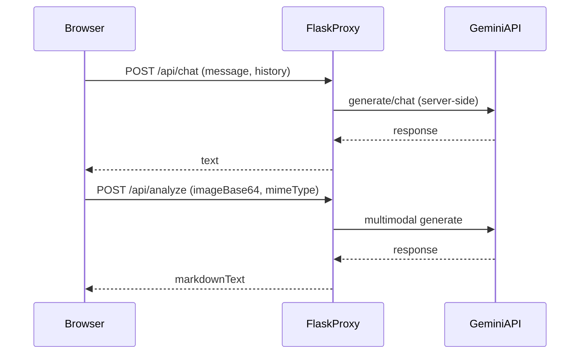

# План: Flask-прокси для Gemini без VPN

## Цель
Сделать так, чтобы приложение работало в РФ/РБ **без VPN**, отправляя запросы к Gemini **через ваш Flask-сервер в другой стране**, а не напрямую из браузера.

## Ключевая идея (поток запросов)

## Что меняем в репозитории
- Добавляем Flask-бекенд:
  - `[backend/app.py](backend/app.py)` — API `/api/chat` и `/api/analyze`
  - `[backend/gemini_client.py](backend/gemini_client.py)` — обёртка над вызовами Gemini
  - `[backend/requirements.txt](backend/requirements.txt)` — зависимости
  - `[backend/.env.example](backend/.env.example)` — `GEMINI_API_KEY`, `PROXY_TOKEN`, `ALLOWED_ORIGINS`
  - `[backend/README.md](backend/README.md)` — запуск локально + деплой (gunicorn)
- Переключаем фронтенд с прямого `@google/genai` на HTTP-вызовы вашего Flask:
  - `[services/gemini.ts](services/gemini.ts)` — заменить SDK-вызовы на `fetch` к `VITE_API_BASE_URL` + заголовок `X-Proxy-Token`
  - При необходимости поправить места использования (например, `components/ChatAssistant.tsx`, `components/WeldAnalyzer.tsx`), если сигнатуры отличаются.

## Детали реализации
- **Безопасность (как вы выбрали):** простой секрет `X-Proxy-Token`
  - Flask проверяет `X-Proxy-Token` против `PROXY_TOKEN` из env
  - Если токен неверный — 401
  - Рекомендация: дополнительно включить простейший rate-limit (по IP) на Flask-стороне (опционально)
- **CORS:** разрешаем только ваш домен(ы) фронтенда через `ALLOWED_ORIGINS`
- **Формат ответов:** нестриминговый JSON `{ text: "..." }`
- **Совместимость с текущей логикой:**
  - `/api/chat` принимает `message` и `history` (как сейчас формируется в `components/ChatAssistant.tsx`)
  - `/api/analyze` принимает `{ base64Image, mimeType }` (как сейчас делает `analyzeWeldImage`)

## Конфиги
- Фронтенд:
  - `.env.local` (или переменные хостинга) `VITE_API_BASE_URL=https://your-proxy-domain`
  - `VITE_PROXY_TOKEN=...` (или другой способ, если не хотите хранить токен в клиенте — тогда потребуется авторизация)
- Бекенд:
  - `GEMINI_API_KEY=...`
  - `PROXY_TOKEN=...`
  - `ALLOWED_ORIGINS=https://your-frontend-domain` (можно список)

## Итог
Пользователь в РФ/РБ обращается к вашему сайту и вашему Flask API **без VPN**; весь трафик к Gemini идёт **с сервера в другой стране**, ключ Gemini остаётся на сервере.

